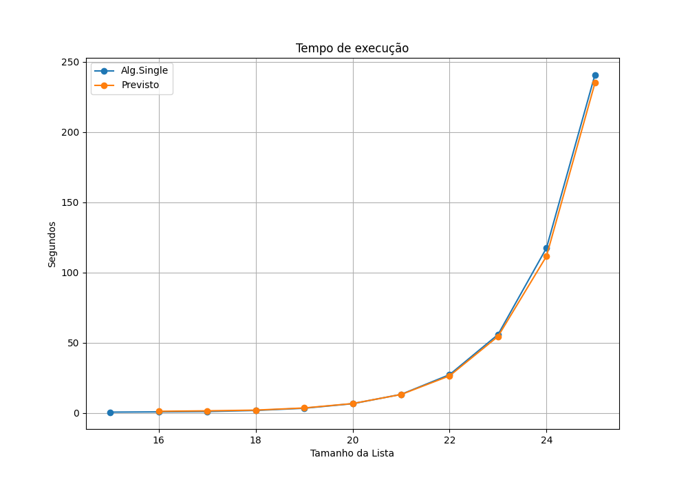
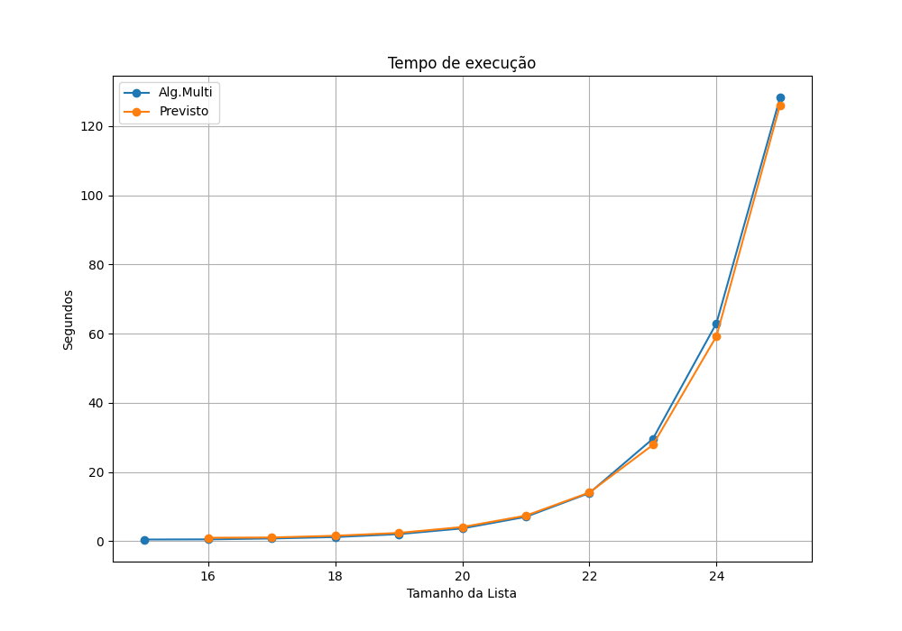
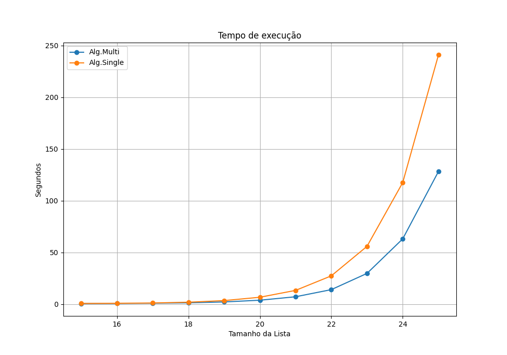

# Programação paralela

O objetivo desse projeto consiste em resolver um desafio de programação, que foi proposto na OBI de 2022. No caso, o desafio desse trabalho, consistiu em resolver o problema do algortimo da OBI de forma paralelizada.
***

# Resultados

## Saída do terminal
    Single

    NUM |       TEMPO SERIAL    |       TEMPO MULTI
    ------------------------------------------------
    15  |   0.5815064907073975  |   0.4984591007232666
    16  |   0.7513282299041748  |   0.5404114723205566
    17  |   1.0030927658081055  |   0.7919602394104004
    18  |   1.768111228942871   |   1.2038085460662842
    19  |   3.3374314308166504  |   2.052337408065796
    20  |   6.568068265914917   |   3.6994025707244873
    21  |   13.207133769989014  |   7.044037342071533
    22  |   27.25486993789673   |   13.93208646774292
    23  |   55.821144819259644  |   29.63389492034912
    24  |   117.50619149208069  |   63.04235029220581
    25  |   240.89537501335144  |   128.19578528404236

***
  
## Gráfico referente ao algotimo serial

***

## Gráfico referente ao algotimo Paralelizado

***

## Gráfico de comparação do algoritmo serial e paralelizado

***
